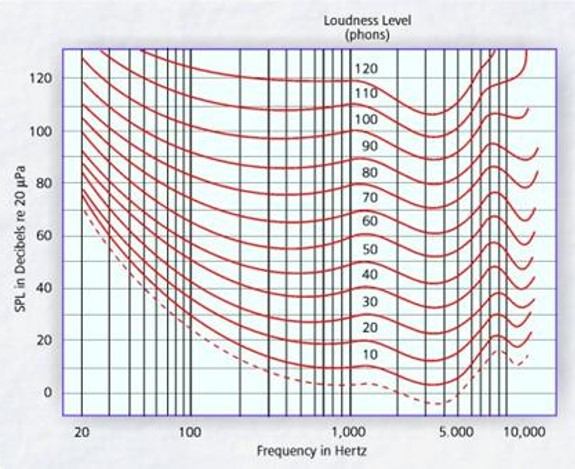

# JUPYTER-LAB SESSIONS on HEARING
For the exercises and demos you need a properly working audio device.  Using good quality headphones is advised.

### Exercise 1: Loudness

- Notebook: AuditoryDemonstrations.ipynb
- Demo: Demo4
- Reference: IPO Auditory Demonstrations CD (Demo4)

### Exercise 2: Pitch

- Notebook: Keyboard.ipynb

### Exercise 3: Frequency Sensitivity of Human Hearing

- Notebook: AuditoryDemonstrations.ipynb
- Demo: Demo6
- Reference: IPO Auditory Demonstrations CD (Demo6)

</img>

### Exercise 4: Effect of Spectrum on Timbre

- Notebook: AuditoryDemonstrations.ipynb
- Demo: Demo28
- Reference: IPO Auditory Demonstrations CD (Demo28))

### Exercise 5: Effect of Tone Envelope on Timbre

- Notebook: AuditoryDemonstrations.ipynb
- Demo: Demo29
- Reference: IPO Auditory Demonstrations CD(Demo29)

### Exercise 6: Effect of Echoes

- Notebook: AuditoryDemonstrations.ipynb
- Demo: Demo35
- Reference: IPO Auditory Demonstrations CD (Demo35)

### Exercise 7: Pitch and Timbre of Harmonic Signals

- Notebook: HarmonicSignals.ipynb
- Exercises:
  + Fourier Synthesis of a Square Wave
  + Pitch and Timbre of Harmonic Signals

### Exercise 8: Harmonic Signals: digging deeper

- Notebook: HarmonicSignals.ipynb
- Exercises:
  + Periodicity and Rhythm
  + Influence of Tone Envelope on Timbre
